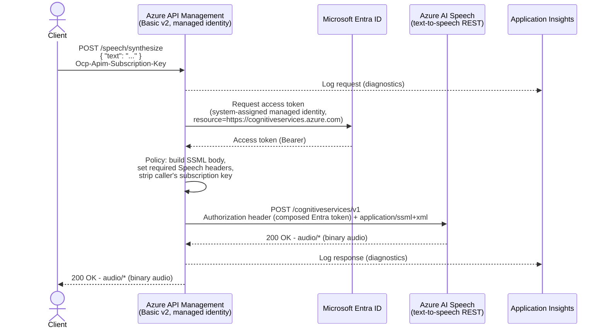
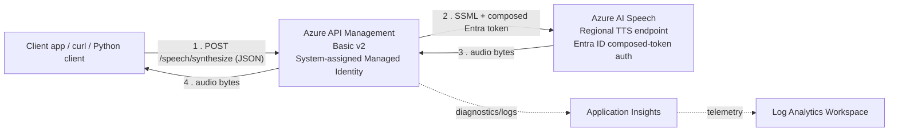

# Azure API Management as a Secure Gateway for Azure Speech Text-to-Speech

A complete, runnable proof of concept showing **Azure API Management (APIM)** acting as a secure REST
gateway in front of the **Azure AI Speech text-to-speech REST API**. No Speech resource key is ever
stored in APIM - the gateway authenticates to Speech using its own **system-assigned managed identity**
(Microsoft Entra ID).

> **Scope note:** This demo intentionally uses only Speech's **REST** APIs: the real-time
> `POST /cognitiveservices/v1` endpoint, and the asynchronous **Batch synthesis API** for long-form text
> (see below). It does **not** use WebSockets or the real-time Speech SDK streaming API.
>
> **Networking note:** Per request, this is a public-endpoint demo only - no VNet integration, private
> endpoints, or network isolation is configured. Do not reuse this as-is for production workloads that
> require network isolation.

This demo exposes **two complementary sets of endpoints**, because Azure Speech's REST TTS surface is
split into two APIs with different constraints (see [Microsoft Learn - Batch synthesis
API](https://learn.microsoft.com/azure/ai-services/speech-service/batch-synthesis) for the current,
authoritative behavior):

| | Real-time (`/speech/synthesize`) | Batch (`/speech/batch/synthesize/{id}`) |
|---|---|---|
| Use case | Short text, synchronous response | Long-form text (articles, documents, audiobooks) |
| Request/response model | One request in, audio bytes back immediately | Submit job (`PUT`), poll status (`GET`), download result separately |
| Text size limit | 64 KB SSML/text per request | Up to 10,000 input items, 2 MB JSON payload |
| Output audio limit | Truncated at 10 minutes | No 10-minute cap |
| Speech backend host | Regional (`https://<region>.tts.speech.microsoft.com`) | Custom subdomain (`https://<name>.cognitiveservices.azure.com`) |
| Entra ID token format | **Composed**: `Bearer aad#<resourceId>#<token>` | **Plain**: `Bearer <token>` |

---

## Architecture





**Flow (real-time):** `Client -> APIM -> Azure Speech text-to-speech REST API -> APIM -> Client (audio)`

### Batch synthesis (long-form text) flow


**Flow (batch):** `Client -> APIM -> Speech (create job) -> APIM -> Client -> [poll] -> Microsoft-managed
storage (direct download, not via APIM)`. See "Why the result download bypasses APIM" below.

---

## Resources Deployed (Bicep)

| Resource | Purpose |
|---|---|
| `Microsoft.ApiManagement/service` | APIM gateway, **SKU `Basicv2`** (fast to deploy, supports system-assigned managed identity, no VNet required) |
| `Microsoft.ApiManagement/service` identity | System-assigned managed identity used to authenticate to Speech |
| `Microsoft.CognitiveServices/accounts` (`kind=SpeechServices`) | Azure AI Speech resource, deployed **with a custom subdomain** (required for Microsoft Entra ID token issuance) |
| `Microsoft.Authorization/roleAssignments` | Grants APIM's managed identity the **`Cognitive Services Speech User`** role, scoped to just the Speech resource |
| `Microsoft.ApiManagement/service/namedValues` | `speech-resource-id` - the Speech account's ARM resource ID (not a secret), used by the real-time policy to build the composed Entra ID token. `speech-batch-api-version` - the Batch synthesis API version string. |
| `Microsoft.ApiManagement/service/backends` | Two backends: `speech-backend` (regional host, for real-time synthesis) and `speech-batch-backend` (custom-subdomain host, for Batch synthesis) - see "How Authentication Works" for why they differ |
| `Microsoft.ApiManagement/service/apis` + `.../operations` | The `speech-api` API with four operations: `POST /speech/synthesize` (real-time) and `PUT`/`GET`/`DELETE /speech/batch/synthesize/{id}` (batch job create/status/delete) |
| `Microsoft.ApiManagement/service/apis/operations/policies` | [`apim/policy.xml`](apim/policy.xml) (real-time) and [`apim/policy-batch-create.xml`](apim/policy-batch-create.xml) / [`policy-batch-status.xml`](apim/policy-batch-status.xml) / [`policy-batch-delete.xml`](apim/policy-batch-delete.xml) (batch) |
| `Microsoft.ApiManagement/service/products` + `.../subscriptions` | A demo product/subscription so the API requires a subscription key like a normal external API |
| `Microsoft.Insights/components` (Application Insights) + `Microsoft.OperationalInsights/workspaces` (Log Analytics) | APIM diagnostic logging of requests/responses |
| `Microsoft.ApiManagement/service/loggers` + `.../diagnostics` | Wires APIM to Application Insights so every call (and its outcome) is logged |

No secrets are hard-coded anywhere - the Speech resource key is not read, stored, or referenced by APIM
at all. By default, the deployment also sets `disableLocalAuth: true` on the Speech resource so **key-based
auth is disabled entirely**, forcing all callers (including APIM) to use Microsoft Entra ID. Set the
`disableSpeechLocalAuth` parameter to `false` if you need the key temporarily for troubleshooting.

---

## Prerequisites

- An Azure subscription with rights to create resource groups, APIM, Cognitive Services accounts, and
  **role assignments** (e.g. `Owner` or `Contributor` + `User Access Administrator` on the resource group).
- [Azure CLI](https://learn.microsoft.com/cli/azure/install-azure-cli) 2.60+ (`az bicep install` will fetch
  the Bicep CLI automatically).
- Python 3.9+ (for the test client) and/or `curl` (for the shell-based test).
- Globally unique names chosen for the APIM service and the Speech resource (edit
  `infra/parameters.bicepparam` before deploying).

---

## How Authentication Works

Azure Speech's text-to-speech REST endpoint supports two authentication headers per the
[Speech REST API reference](https://learn.microsoft.com/azure/ai-services/speech-service/rest-text-to-speech):

| Header | Supported | Used here? |
|---|---|---|
| `Ocp-Apim-Subscription-Key` (resource key) | Yes | **No** - avoided to keep secrets out of APIM entirely |
| `Authorization` (Bearer scheme) | Yes | **Yes** - token obtained via APIM's managed identity |

This POC uses the `Authorization: Bearer` path, where the token is a **Microsoft Entra ID** access token
obtained through APIM's `authentication-managed-identity` policy - no Speech key is ever generated,
stored, or referenced by APIM. Verified requirements for this path (confirmed against the live service,
not just documentation - see callout below):

1. **Custom subdomain required.** Microsoft Entra ID token issuance for Cognitive Services/Speech only
   works when the resource has a **custom subdomain** configured
   (`https://<name>.cognitiveservices.azure.com`). The Bicep template sets `customSubDomainName` on the
   Speech resource for this reason.
2. **Token audience / resource.** The token must be requested for resource/audience
   `https://cognitiveservices.azure.com` (i.e. scope `https://cognitiveservices.azure.com/.default`).
   The policy uses `<authentication-managed-identity resource="https://cognitiveservices.azure.com" .../>`.
3. **Required RBAC role.** The identity calling Speech needs the built-in
   **`Cognitive Services Speech User`** role (`f2dc8367-1007-4938-bd23-fe263f013447`) on the Speech
   resource (or `Cognitive Services Speech Contributor` for management operations, not needed here). The
   Bicep template assigns this role to APIM's managed identity, scoped only to the Speech resource
   (least privilege).
4. **Composed token format required.** The `Authorization` header must carry a composed token:
   `Bearer aad#<Speech-resource-ARM-ID>#<Microsoft-Entra-access-token>` (per the "Use Microsoft Entra
   authentication" section of the Speech REST API reference). A plain bearer token (just the raw Entra
   token) is rejected. The policy builds this string using a named value (`{{speech-resource-id}}`, set
   in Bicep to the Speech account's ARM resource ID - not a secret) concatenated with the token from
   `authentication-managed-identity`.
5. **The synthesis call must target the REGIONAL host, not the custom-subdomain host.**

   > **Verified-against-live-service correction:** Microsoft's TTS REST documentation page currently
   > illustrates its Microsoft Entra ID example by reusing a **Speech-to-text** sample request whose
   > `Host` header is the custom-subdomain endpoint. In practice, for the **text-to-speech**
   > `/cognitiveservices/v1` call, the custom-subdomain host (`https://<name>.cognitiveservices.azure.com`)
   > returns `HTTP 404` regardless of token format, while the **regional** host
   > (`https://<region>.tts.speech.microsoft.com`) returns `HTTP 200` when given the composed token
   > described above (and `HTTP 401` with a plain bearer token). This was confirmed by direct testing
   > against a deployed Speech resource, including cross-checking with the resource's own advertised
   > `endpoints` map (via `az resource show`), which lists `"Speech Services Text to Speech (Neural)"` as
   > the regional host even though a custom subdomain is configured. The custom subdomain is still
   > required (it's what enables Entra ID token issuance/scoping for the resource in the first place) -
   > it's simply not the host you send the synthesis `POST` to. The Bicep template's `speech-backend`
   > therefore points at `https://<region>.tts.speech.microsoft.com`, and the policy still builds the
   > composed token described above. If Microsoft updates the endpoint behavior or documentation,
   > re-verify before relying on this in production.

Because Speech's REST auth model doesn't support Entra ID for every possible Speech feature (e.g. some
older/regional-only endpoints), the general documented, secure alternative when managed identity truly
cannot be used is to store the Speech key in **Azure Key Vault** and reference it from an APIM
**named value with Key Vault backing** (`keyVault` secret reference) rather than embedding it in policy
XML or source code. This demo does not need that fallback because the TTS REST endpoint fully supports
Entra ID auth (with the composed-token, regional-host nuances documented above).

### Authentication for the Batch synthesis API (different from real-time!)

The [Batch synthesis API](https://learn.microsoft.com/azure/ai-services/speech-service/batch-synthesis)
(`texttospeech/batchsyntheses/*`) also supports Microsoft Entra ID / managed identity, but with **two
important differences** from the real-time endpoint above (both confirmed against the live service in
this demo):

1. **Host:** Batch synthesis is served from the resource's **custom-subdomain host**
   (`https://<name>.cognitiveservices.azure.com`), not the regional `tts.speech.microsoft.com` host used
   by real-time synthesis.
2. **Token format:** The `Authorization` header is a **plain** bearer token (`Bearer <entra-token>`) -
   there is **no** `aad#<resourceId>#` composition for this API, unlike the real-time endpoint.

Same RBAC role (`Cognitive Services Speech User`) works for both APIs, so no additional role assignment
was needed - `apim/policy-batch-create.xml`, `policy-batch-status.xml`, and `policy-batch-delete.xml`
simply call `authentication-managed-identity` and set the header directly, without the composed-token
step. The `speech-batch-backend` Bicep resource points at the custom-subdomain host accordingly.

### Why the Batch result download bypasses APIM

When a batch job succeeds, its status JSON includes `outputs.result` - the audio is not returned in the
status response body. By default (no customer storage account configured), Speech auto-manages the
output storage and `outputs.result` is a **full, time-limited SAS URL** pointing directly at Microsoft's
storage. The documented pattern is to download directly from that URL; there is no supported way to
"pull" that blob through APIM as part of the same request (APIM never sees the file - only a URL
string), and proxying it would require a third backend pointing at an arbitrary, ever-changing SAS host,
which adds complexity for no real benefit in this demo. Both `client/test_batch_tts.py` and
`scripts/test-batch.sh` download from that URL directly, then unzip the result locally (the result is a
`.zip` containing the `.wav` audio, a debug JSON, and a summary JSON - this is Speech's default packaging
when no destination container is configured).

---

## How the APIM Policy Works

See [`apim/policy.xml`](apim/policy.xml) for the full, commented policy. Summary of the `inbound` section
applied to `POST /speech/synthesize`:

1. **Backend routing** - `<set-backend-service backend-id="speech-backend" />` routes to the Speech
   regional text-to-speech endpoint defined as an APIM backend resource.
2. **Input validation** - parses the JSON body; returns `400 Bad Request` with a JSON error body if it's
   missing, malformed, or has no `text` field.
3. **JSON -> SSML transformation** - extracts `text` (required) plus optional `voice`, `language`, and
   `outputFormat`, XML-escapes the text, and builds the SSML document Speech's TTS REST endpoint requires
   (`<speak>...<voice>...</voice></speak>`).
4. **Strip caller secrets** - removes the inbound `Ocp-Apim-Subscription-Key` header so the client's APIM
   key is never forwarded to the Speech backend.
5. **Backend authentication** - `<authentication-managed-identity resource="https://cognitiveservices.azure.com" .../>`
   fetches a Microsoft Entra ID token for APIM's managed identity, then builds the composed token and
   sets the `Authorization` header to `Bearer aad#{{speech-resource-id}}#<token>`.
6. **Required Speech headers** - sets `Content-Type: application/ssml+xml`, `X-Microsoft-OutputFormat`
   (default `riff-24khz-16bit-mono-pcm`, a WAV/PCM format that plays natively almost everywhere), and a
   `User-Agent`.
7. **Method/URI rewrite** - forces `POST` and rewrites the path to `/cognitiveservices/v1`, the documented
   Speech TTS REST path (on the regional backend host).
8. In `outbound`, the response (binary audio with its original `Content-Type`, e.g. `audio/x-wav`) is
   passed straight back to the client unmodified.
9. `on-error` returns a clean `502 Bad Gateway` JSON error body, with a specific message when the failure
   is the managed-identity token acquisition (likely an RBAC propagation delay or missing role
   assignment) versus a generic backend failure.

### How the Batch synthesis policies work

See [`apim/policy-batch-create.xml`](apim/policy-batch-create.xml),
[`policy-batch-status.xml`](apim/policy-batch-status.xml), and
[`policy-batch-delete.xml`](apim/policy-batch-delete.xml). They're intentionally simpler than the
real-time policy:

- **Create (`PUT`)** - same JSON input shape and validation as `/speech/synthesize` (`text` required,
  `voice`/`language`/`outputFormat` optional with the same defaults), builds the same SSML, then wraps it
  in the Batch synthesis request body (`inputKind: "SSML"`, `inputs: [...]`, `properties.outputFormat`).
  Authenticates with a **plain** Entra bearer token (see auth section above) and rewrites the URI to
  `/texttospeech/batchsyntheses/{id}?api-version={{speech-batch-api-version}}`.
- **Status (`GET`)** - pure pass-through: authenticate, rewrite the URI, forward. Returns the job's
  status JSON (including `outputs.result` once `"status": "Succeeded"`).
- **Delete (`DELETE`)** - pure pass-through: authenticate, rewrite the URI, forward. Deletes the job and
  its Microsoft-managed output storage.

All three strip the caller's `Ocp-Apim-Subscription-Key` before forwarding, and share the same
`on-error` pattern as the real-time policy.

---

## Deploying

1. **Edit names** in `infra/parameters.bicepparam` - `apimServiceName` and `speechAccountName` must be
   globally unique.

2. **Log in and select a subscription:**

   ```bash
   az login
   az account set --subscription "<subscription-id-or-name>"
   ```

3. **Deploy:**

   ```bash
   ./scripts/deploy.sh rg-apim-speech-demo eastus
   ```

   This script:
   - Creates the resource group if needed.
   - Runs `az deployment group validate`.
   - Runs `az deployment group create` using `infra/main.bicep` + `infra/parameters.bicepparam`.
   - Prints the deployment outputs (APIM gateway URL, Speech custom subdomain, etc.).

   Equivalent manual commands:

   ```bash
   az group create --name rg-apim-speech-demo --location eastus

   az deployment group create \
     --resource-group rg-apim-speech-demo \
     --template-file infra/main.bicep \
     --parameters infra/parameters.bicepparam
   ```

   > **Timing:** APIM `Basicv2` typically provisions in ~10-20 minutes (much faster than `Developer`/
   > `Premium`, which is why it was chosen for this demo). RBAC role assignments can take a few extra
   > minutes to propagate - if your first test returns `401`/`403`/`502` from the Speech backend, wait
   > ~5 minutes and retry.

---

## Testing

### Option A: provided shell script (curl)

```bash
./scripts/test.sh rg-apim-speech-demo
```

This looks up the APIM service and gateway URL, fetches the demo subscription key, and saves the audio
response to `output.wav` in the current directory.

You can also override the text, voice, and language:

```bash
./scripts/test.sh rg-apim-speech-demo apim-speech-demo01 output_en_gb.wav \
  --text "Good afternoon, this is Ryan speaking with a British accent." \
  --voice en-GB-RyanNeural \
  --language en-GB
```

`--voice` and `--language` are optional; if omitted, the policy defaults to `en-US-JennyNeural` / `en-US`.
See **Choosing a voice and language** below for a list of popular voice names, or how to list every voice
your Speech resource supports.

### Option B: exact curl command

```bash
GATEWAY_URL=$(az apim show --name <apim-name> --resource-group <rg> --query "gatewayUrl" -o tsv)
SUB_KEY=$(az rest --method post \
  --uri "https://management.azure.com/subscriptions/<sub-id>/resourceGroups/<rg>/providers/Microsoft.ApiManagement/service/<apim-name>/subscriptions/speech-demo-subscription/listSecrets?api-version=2024-05-01" \
  --query "primaryKey" -o tsv)

curl -X POST "${GATEWAY_URL}/speech/synthesize" \
  -H "Ocp-Apim-Subscription-Key: ${SUB_KEY}" \
  -H "Content-Type: application/json" \
  -d '{"text": "Hello, this is a test of Azure Speech through Azure API Management."}' \
  --output output.wav -w "HTTP %{http_code}\n"
```

Play the result, e.g. on macOS: `afplay output.wav`.

### Option C: Python test client

```bash
pip install -r client/requirements.txt

python client/test_tts.py \
  --gateway-url "$(az apim show --name <apim-name> --resource-group <rg> --query gatewayUrl -o tsv)" \
  --subscription-key "<subscription-key-from-above>" \
  --text "Hello, this is a test of Azure Speech through Azure API Management." \
  --output output.wav
```

The client prints the HTTP status code and response `Content-Type`, saves the audio to disk, and
exits non-zero with a clear error message on failure (bad input, network error, non-200 response, or
non-audio content type). Like the shell script, it also accepts `--voice` and `--language`:

```bash
python client/test_tts.py \
  --gateway-url "$(az apim show --name <apim-name> --resource-group <rg> --query gatewayUrl -o tsv)" \
  --subscription-key "<subscription-key-from-above>" \
  --text "Bonjour, ceci est un test." \
  --voice fr-FR-DeniseNeural \
  --language fr-FR \
  --output output_fr.wav
```

### Option D: Batch synthesis (long-form text)

For long-form text, use the batch endpoints instead (see "Architecture" above for why they differ).
Both the shell script and Python client submit a job, poll until it succeeds, download the result
directly from Microsoft-managed storage, unzip it, and clean up the job afterwards.

```bash
./scripts/test-batch.sh rg-apim-speech-demo
```

```bash
pip install -r client/requirements.txt

python client/test_batch_tts.py \
  --gateway-url "$(az apim show --name <apim-name> --resource-group <rg> --query gatewayUrl -o tsv)" \
  --subscription-key "<subscription-key-from-above>" \
  --text "This is a longer piece of text suitable for the batch synthesis API." \
  --voice en-US-JennyNeural \
  --language en-US \
  --output batch_output.wav
```

Both accept `--keep-job` (script flag / Python flag) to leave the job in place instead of deleting it
(useful if you want to inspect it further with `az rest` or the status endpoint yourself). Jobs are
retained by Speech for `timeToLiveInHours` (default: 744 hours / 31 days) even if never deleted.

To call the batch endpoints manually with curl:

```bash
# 1. Submit
curl -X PUT "$GATEWAY_URL/speech/batch/synthesize/my-job-1" \
  -H "Ocp-Apim-Subscription-Key: $SUB_KEY" -H "Content-Type: application/json" \
  -d '{"text":"Long-form text here."}'

# 2. Poll (repeat until "status":"Succeeded")
curl "$GATEWAY_URL/speech/batch/synthesize/my-job-1" -H "Ocp-Apim-Subscription-Key: $SUB_KEY"

# 3. Download the result directly (URL comes from the poll response's outputs.result) and unzip it
curl -o result.zip "<outputs.result SAS URL from step 2>"
unzip result.zip   # produces 0001.wav, 0001.debug.json, summary.json

# 4. Clean up
curl -X DELETE "$GATEWAY_URL/speech/batch/synthesize/my-job-1" -H "Ocp-Apim-Subscription-Key: $SUB_KEY"
```

### Choosing a voice and language

The `text`, `voice`, `language`, and `outputFormat` JSON fields are all optional (see
[`apim/policy.xml`](apim/policy.xml) for the defaults). Azure Speech offers 400+ neural voices across
100+ locales; a few popular ones to try:

| Voice short name | Locale | Gender |
|---|---|---|
| `en-US-JennyNeural` (default) | en-US | Female |
| `en-US-GuyNeural` | en-US | Male |
| `en-US-AriaNeural` | en-US | Female |
| `en-GB-SoniaNeural` | en-GB | Female |
| `en-GB-RyanNeural` | en-GB | Male |
| `es-ES-ElviraNeural` | es-ES | Female |
| `fr-FR-DeniseNeural` | fr-FR | Female |
| `de-DE-KatjaNeural` | de-DE | Female |
| `ja-JP-NanamiNeural` | ja-JP | Female |
| `zh-CN-XiaoxiaoNeural` | zh-CN | Female |

To list **every** voice available to your Speech resource (name, gender, locale, supported styles),
call the Speech REST "voices list" endpoint directly with an access token
(see [Get a list of voices](https://learn.microsoft.com/azure/ai-services/speech-service/rest-text-to-speech#get-a-list-of-voices)):

```bash
TOKEN=$(az account get-access-token --resource https://cognitiveservices.azure.com --query accessToken -o tsv)
curl -s "https://<speech-account-name>.cognitiveservices.azure.com/tts/cognitiveservices/voices/list" \
  -H "Authorization: Bearer ${TOKEN}" | python3 -m json.tool | less
```

> Note: this requires your own account (or whoever runs the command) to also have the
> `Cognitive Services Speech User` role on the Speech resource - APIM's managed identity has it by
> default, but your personal login likely does not. Grant it temporarily with
> `az role assignment create --assignee <your-upn-or-object-id> --role "Cognitive Services Speech User" --scope <speech-resource-id>`
> if you want to run this yourself, and remove it afterward.

### Viewing logs in Application Insights

The `appi-speech-*` Application Insights instance (linked to a `law-speech-*` Log Analytics workspace)
receives APIM request/response diagnostics. In the Azure portal, open the Application Insights resource
-> **Logs**, and query, e.g.:

```kusto
requests
| where cloud_RoleName == "<apim-name>"
| order by timestamp desc
| take 50
```

---

## Clean Up

Delete the entire resource group to remove all resources created by this demo:

```bash
az group delete --name rg-apim-speech-demo --yes --no-wait
```

---

## Troubleshooting

| Symptom | Likely cause | Fix |
|---|---|---|
| `502` with `"error":"backend_authentication_failed"` | APIM managed identity role assignment hasn't propagated yet, or wasn't created | Wait 5-10 minutes after deployment and retry. Verify with `az role assignment list --assignee <apim-principal-id> --scope <speech-resource-id>`. |
| `404 Resource not found` from the Speech backend (not APIM's own 404) | The synthesis call was sent to the custom-subdomain host instead of the regional host, or the `Authorization` header used a plain bearer token instead of the composed `aad#<resourceId>#<token>` format | Confirm `speech-backend`'s URL is the regional host (`https://<region>.tts.speech.microsoft.com`) and that the policy sets the composed Authorization header correctly - see "How Authentication Works" for the verified requirement. |
| `401 Unauthorized` from Speech | Custom subdomain missing/misconfigured, wrong token audience, or the `Authorization` header is missing the `aad#` composition on the regional host | Confirm the Speech resource has a custom subdomain (`az cognitiveservices account show --name <speech> --resource-group <rg> --query properties.customSubDomainName`), that the policy's `authentication-managed-identity resource` is exactly `https://cognitiveservices.azure.com`, and that the token is composed as described above. |
| `400 Bad Request` from APIM | Missing/empty `text` field, or malformed JSON | Confirm your request body is `{"text": "..."}`. Check the JSON error message returned by the policy. |
| `415 Unsupported Media Type` from Speech | `Content-Type` not exactly `application/ssml+xml` reaching the backend | Confirm you haven't overridden the policy's `Content-Type` header downstream of the SSML build step. |
| `403` calling `az deployment group create` for the role assignment | Your account lacks `Microsoft.Authorization/roleAssignments/write` | Ask a subscription/RG `Owner` (or `User Access Administrator`) to run the deployment, or grant you that role. |
| `401` returned by APIM itself (not the backend) | Wrong/missing `Ocp-Apim-Subscription-Key` | Re-fetch the subscription key (see Testing section); the API has `subscriptionRequired: true`. |
| Audio file won't play | Wrong output format requested, or truncated download | Try the default `riff-24khz-16bit-mono-pcm` (WAV) output format; verify the byte count printed by the test client matches the file size on disk. |
| Slow first deployment | Basic v2 still provisioning | Basic v2 is faster than Developer/Premium but still takes ~10-20 minutes; this is expected. |
| Batch job `status` stuck on `"Running"` | Normal for larger inputs - synthesis is asynchronous and can take longer than a single real-time call | Keep polling `GET /speech/batch/synthesize/{id}`; `scripts/test-batch.sh` and `client/test_batch_tts.py` both poll automatically (default timeout 300s for the Python client). |
| Batch job `status` is `"Failed"` | Malformed SSML, unsupported voice/locale combination, or a transient backend error | Inspect the full status JSON body for `properties.billingDetails`/error details; retry with a known-good voice (see voice table above). |
| `404`/`401` from the **batch** backend specifically | Using the real-time endpoint's rules by mistake - batch synthesis needs the **custom-subdomain host** and a **plain** bearer token (no `aad#` composition) | Confirm `speech-batch-backend`'s URL is `https://<speech-name>.cognitiveservices.azure.com` and that `policy-batch-*.xml` set `Authorization: Bearer <token>` directly - see "Authentication for the Batch synthesis API" above. |
| Batch result download (`curl outputs.result`) fails with `403`/expired signature | The SAS URL in the status JSON is time-limited and regenerated on each poll | Re-fetch the status (`GET /speech/batch/synthesize/{id}`) to get a fresh `outputs.result` URL, then download immediately. |

---

## Repository Structure

```
/
├── README.md
├── infra/
│   ├── main.bicep              # All infrastructure (APIM, Speech, RBAC, App Insights, APIs + policies)
│   └── parameters.bicepparam   # Parameter values - edit names before deploying
├── apim/
│   ├── policy.xml                  # Real-time /speech/synthesize policy
│   ├── policy-batch-create.xml     # Batch synthesis: PUT /speech/batch/synthesize/{id}
│   ├── policy-batch-status.xml     # Batch synthesis: GET /speech/batch/synthesize/{id}
│   └── policy-batch-delete.xml     # Batch synthesis: DELETE /speech/batch/synthesize/{id}
├── client/
│   ├── test_tts.py             # Python test client (real-time)
│   ├── test_batch_tts.py       # Python test client (batch: submit/poll/download/cleanup)
│   └── requirements.txt
└── scripts/
    ├── deploy.sh                # az deployment group create wrapper
    ├── test.sh                  # curl-based smoke test wrapper (real-time)
    └── test-batch.sh            # curl-based smoke test wrapper (batch: submit/poll/download/cleanup)
```
