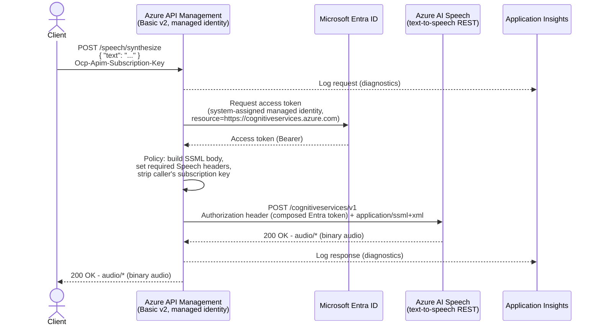
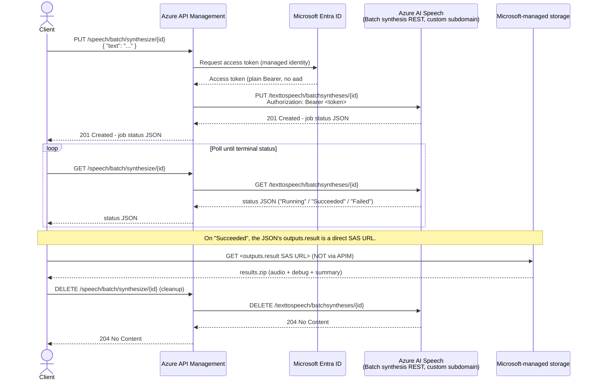

# Azure API Management as a Secure Gateway for Azure Speech Text-to-Speech

A complete, runnable proof of concept showing **Azure API Management (APIM)** acting as a secure REST
gateway in front of the **Azure AI Speech text-to-speech REST API**. No Speech resource key is ever
stored in APIM - the gateway authenticates to Speech using its own **system-assigned managed identity**
(Microsoft Entra ID).

> **Scope note:** This demo intentionally uses only Speech's **REST** APIs: the real-time
> `POST /cognitiveservices/v1` endpoint, and the asynchronous **Batch synthesis API** for long-form text
> (see below). It does **not** use WebSockets or the real-time Speech SDK streaming API.
>
> **Networking note:** Per request, this is a public-endpoint demo only - no VNet integration, private
> endpoints, or network isolation is configured. Do not reuse this as-is for production workloads that
> require network isolation.

**Want the deep technical details?** This README is a quickstart. For the verified authentication
requirements (composed vs. plain Entra tokens, regional vs. custom-subdomain hosts), see
[`docs/AUTHENTICATION.md`](docs/AUTHENTICATION.md). For a step-by-step walkthrough of the policy XML,
see [`docs/POLICY-REFERENCE.md`](docs/POLICY-REFERENCE.md). For manual/raw curl commands and the full
troubleshooting table, see [`docs/TESTING.md`](docs/TESTING.md).

This demo exposes **two complementary sets of endpoints**, because Azure Speech's REST TTS surface is
split into two APIs with different constraints (see [Microsoft Learn - Batch synthesis
API](https://learn.microsoft.com/azure/ai-services/speech-service/batch-synthesis) for the current,
authoritative behavior):

| | Real-time (`/speech/synthesize`) | Batch (`/speech/batch/synthesize/{id}`) |
|---|---|---|
| Use case | Short text, synchronous response | Long-form text (articles, documents, audiobooks) |
| Request/response model | One request in, audio bytes back immediately | Submit job (`PUT`), poll status (`GET`), download result separately |
| Text size limit | 64 KB SSML/text per request | Up to 10,000 input items, 2 MB JSON payload |
| Output audio limit | Truncated at 10 minutes | No 10-minute cap |
| Speech backend host | Regional (`https://<region>.tts.speech.microsoft.com`) | Custom subdomain (`https://<name>.cognitiveservices.azure.com`) |
| Entra ID token format | **Composed**: `Bearer aad#<resourceId>#<token>` | **Plain**: `Bearer <token>` |

---

## Architecture



**Flow (real-time):** `Client -> APIM -> Azure Speech text-to-speech REST API -> APIM -> Client (audio)`

<details>
<summary>Batch synthesis (long-form text) sequence diagram and flow</summary>



**Flow (batch):** `Client -> APIM -> Speech (create job) -> APIM -> Client -> [poll] -> Microsoft-managed
storage (direct download, not via APIM)`. See [`docs/AUTHENTICATION.md`](docs/AUTHENTICATION.md#why-the-batch-result-download-bypasses-apim)
for why the result download bypasses APIM.

</details>

---

## Resources Deployed (Bicep)

| Resource | Purpose |
|---|---|
| `Microsoft.ApiManagement/service` | APIM gateway, **SKU `Basicv2`** (fast to deploy, supports system-assigned managed identity, no VNet required) |
| `Microsoft.ApiManagement/service` identity | System-assigned managed identity used to authenticate to Speech |
| `Microsoft.CognitiveServices/accounts` (`kind=SpeechServices`) | Azure AI Speech resource, deployed **with a custom subdomain** (required for Microsoft Entra ID token issuance) |
| `Microsoft.Authorization/roleAssignments` | Grants APIM's managed identity the **`Cognitive Services Speech User`** role, scoped to just the Speech resource |
| `Microsoft.ApiManagement/service/namedValues` | `speech-resource-id` - the Speech account's ARM resource ID (not a secret), used by the real-time policy to build the composed Entra ID token. `speech-batch-api-version` - the Batch synthesis API version string. |
| `Microsoft.ApiManagement/service/backends` | Two backends: `speech-backend` (regional host, for real-time synthesis) and `speech-batch-backend` (custom-subdomain host, for Batch synthesis) - see [`docs/AUTHENTICATION.md`](docs/AUTHENTICATION.md) for why they differ |
| `Microsoft.ApiManagement/service/apis` + `.../operations` | The `speech-api` API with four operations: `POST /speech/synthesize` (real-time) and `PUT`/`GET`/`DELETE /speech/batch/synthesize/{id}` (batch job create/status/delete) |
| `Microsoft.ApiManagement/service/apis/operations/policies` | [`apim/policy.xml`](apim/policy.xml) (real-time) and [`apim/policy-batch-create.xml`](apim/policy-batch-create.xml) / [`policy-batch-status.xml`](apim/policy-batch-status.xml) / [`policy-batch-delete.xml`](apim/policy-batch-delete.xml) (batch) |
| `Microsoft.ApiManagement/service/products` + `.../subscriptions` | A demo product/subscription so the API requires a subscription key like a normal external API |
| `Microsoft.Insights/components` (Application Insights) + `Microsoft.OperationalInsights/workspaces` (Log Analytics) | APIM diagnostic logging of requests/responses |
| `Microsoft.ApiManagement/service/loggers` + `.../diagnostics` | Wires APIM to Application Insights so every call (and its outcome) is logged |

No secrets are hard-coded anywhere - the Speech resource key is not read, stored, or referenced by APIM
at all. By default, the deployment also sets `disableLocalAuth: true` on the Speech resource so **key-based
auth is disabled entirely**, forcing all callers (including APIM) to use Microsoft Entra ID. Set the
`disableSpeechLocalAuth` parameter to `false` if you need the key temporarily for troubleshooting.

---

## Prerequisites

- An Azure subscription with rights to create resource groups, APIM, Cognitive Services accounts, and
  **role assignments** (e.g. `Owner` or `Contributor` + `User Access Administrator` on the resource group).
- [Azure CLI](https://learn.microsoft.com/cli/azure/install-azure-cli) 2.60+ (`az bicep install` will fetch
  the Bicep CLI automatically).
- Python 3.9+ (for the test client) and/or `curl` (for the shell-based test).
- Globally unique names chosen for the APIM service and the Speech resource (edit
  `infra/parameters.bicepparam` before deploying).

---

## How Authentication Works (summary)

Both APIs authenticate to Speech using APIM's **system-assigned managed identity** - a Microsoft Entra ID
token is fetched by the policy (`authentication-managed-identity`) and no Speech key is ever stored or
referenced by APIM. The two APIs need different Entra ID token *formats* and different Speech *hosts*
(see the comparison table above), both verified against the live service. **Full details, including the
documented fallback for when managed identity can't be used, are in
[`docs/AUTHENTICATION.md`](docs/AUTHENTICATION.md).**

## How the APIM Policies Work (summary)

Each operation's policy validates the incoming JSON, builds the SSML Speech requires, authenticates with
the managed identity, sets the Speech-specific headers, rewrites the request to the Speech REST path, and
passes the response straight back to the client (binary audio for real-time, job-status JSON for batch).
**Full step-by-step walkthroughs are in [`docs/POLICY-REFERENCE.md`](docs/POLICY-REFERENCE.md)**; see the
raw files: [`apim/policy.xml`](apim/policy.xml), [`apim/policy-batch-create.xml`](apim/policy-batch-create.xml),
[`policy-batch-status.xml`](apim/policy-batch-status.xml), [`policy-batch-delete.xml`](apim/policy-batch-delete.xml).

---

## Deploying

1. **Edit names** in `infra/parameters.bicepparam` - `apimServiceName` and `speechAccountName` must be
   globally unique.

2. **Log in and select a subscription:**

   ```bash
   az login
   az account set --subscription "<subscription-id-or-name>"
   ```

3. **Deploy:**

   ```bash
   ./scripts/deploy.sh rg-apim-speech-demo eastus
   ```

   This script:
   - Creates the resource group if needed.
   - Runs `az deployment group validate`.
   - Runs `az deployment group create` using `infra/main.bicep` + `infra/parameters.bicepparam`.
   - Prints the deployment outputs (APIM gateway URL, Speech custom subdomain, etc.).

   Equivalent manual commands:

   ```bash
   az group create --name rg-apim-speech-demo --location eastus

   az deployment group create \
     --resource-group rg-apim-speech-demo \
     --template-file infra/main.bicep \
     --parameters infra/parameters.bicepparam
   ```

   > **Timing:** APIM `Basicv2` typically provisions in ~10-20 minutes (much faster than `Developer`/
   > `Premium`, which is why it was chosen for this demo). RBAC role assignments can take a few extra
   > minutes to propagate - if your first test returns `401`/`403`/`502` from the Speech backend, wait
   > ~5 minutes and retry.

---

## Testing

### Real-time synthesis

```bash
./scripts/test.sh rg-apim-speech-demo
```

Looks up the APIM service and gateway URL, fetches the demo subscription key, and saves the audio
response to `output.wav`. Override text/voice/language:

```bash
./scripts/test.sh rg-apim-speech-demo apim-speech-demo01 output_en_gb.wav \
  --text "Good afternoon, this is Ryan speaking with a British accent." \
  --voice en-GB-RyanNeural \
  --language en-GB
```

Or with the Python client:

```bash
pip install -r client/requirements.txt

python client/test_tts.py \
  --gateway-url "$(az apim show --name <apim-name> --resource-group <rg> --query gatewayUrl -o tsv)" \
  --subscription-key "<subscription-key-from-above>" \
  --text "Hello, this is a test of Azure Speech through Azure API Management." \
  --output output.wav
```

The client prints the HTTP status code and response `Content-Type`, saves the audio to disk, and exits
non-zero with a clear error message on failure. `--voice`/`--language` are optional; if omitted, the
policy defaults to `en-US-JennyNeural` / `en-US`. A few popular voices to try:

| Voice short name | Locale | Gender |
|---|---|---|
| `en-US-JennyNeural` (default) | en-US | Female |
| `en-US-GuyNeural` | en-US | Male |
| `en-GB-SoniaNeural` | en-GB | Female |
| `es-ES-ElviraNeural` | es-ES | Female |
| `fr-FR-DeniseNeural` | fr-FR | Female |
| `de-DE-KatjaNeural` | de-DE | Female |
| `ja-JP-NanamiNeural` | ja-JP | Female |
| `zh-CN-XiaoxiaoNeural` | zh-CN | Female |

Azure Speech offers 400+ neural voices across 100+ locales - see
[`docs/TESTING.md`](docs/TESTING.md#listing-every-available-voice) for how to list every voice your
Speech resource supports.

### Batch synthesis (long-form text)

For long-form text, use the batch endpoints instead (see the comparison table above for why they
differ). Both the shell script and Python client submit a job, poll until it succeeds, download the
result directly from Microsoft-managed storage, unzip it, and clean up the job afterwards.

```bash
./scripts/test-batch.sh rg-apim-speech-demo
```

```bash
python client/test_batch_tts.py \
  --gateway-url "$(az apim show --name <apim-name> --resource-group <rg> --query gatewayUrl -o tsv)" \
  --subscription-key "<subscription-key-from-above>" \
  --text "This is a longer piece of text suitable for the batch synthesis API." \
  --output batch_output.wav
```

Both accept `--keep-job` to leave the job in place instead of deleting it (jobs are retained by Speech
for `timeToLiveInHours`, default 744 hours / 31 days, even if never deleted).

**Need the raw curl commands or Application Insights log queries?** See
[`docs/TESTING.md`](docs/TESTING.md).

---

## Clean Up

Delete the entire resource group to remove all resources created by this demo:

```bash
az group delete --name rg-apim-speech-demo --yes --no-wait
```

---

## Troubleshooting

| Symptom | Likely cause | Fix |
|---|---|---|
| `502` with `"error":"backend_authentication_failed"` | APIM managed identity role assignment hasn't propagated yet | Wait 5-10 minutes after deployment and retry. |
| `404`/`401` from the Speech backend (real-time) | Wrong host or token format for the real-time API | See [`docs/AUTHENTICATION.md`](docs/AUTHENTICATION.md) - real-time needs the regional host + composed token. |
| `404`/`401` from the Speech backend (batch) | Wrong host or token format for the batch API | See [`docs/AUTHENTICATION.md`](docs/AUTHENTICATION.md) - batch needs the custom-subdomain host + plain token. |
| `400 Bad Request` from APIM | Missing/empty `text` field, or malformed JSON | Confirm your request body is `{"text": "..."}`. |
| `401` returned by APIM itself | Wrong/missing `Ocp-Apim-Subscription-Key` | Re-fetch the subscription key (see Testing section). |
| Slow first deployment | Basic v2 still provisioning | Expected; takes ~10-20 minutes. |
| Batch job stuck on `"Running"` | Normal for larger inputs | Keep polling; the scripts/clients do this automatically. |

**Full troubleshooting table (15 rows) in [`docs/TESTING.md`](docs/TESTING.md#full-troubleshooting-table).**

---

## Repository Structure

```
/
├── README.md
├── docs/
│   ├── AUTHENTICATION.md       # Verified auth deep dive (real-time vs. batch)
│   ├── POLICY-REFERENCE.md     # Step-by-step policy walkthroughs
│   └── TESTING.md              # Raw curl commands, voice listing, full troubleshooting table
├── infra/
│   ├── main.bicep              # All infrastructure (APIM, Speech, RBAC, App Insights, APIs + policies)
│   └── parameters.bicepparam   # Parameter values - edit names before deploying
├── apim/
│   ├── policy.xml                  # Real-time /speech/synthesize policy
│   ├── policy-batch-create.xml     # Batch synthesis: PUT /speech/batch/synthesize/{id}
│   ├── policy-batch-status.xml     # Batch synthesis: GET /speech/batch/synthesize/{id}
│   └── policy-batch-delete.xml     # Batch synthesis: DELETE /speech/batch/synthesize/{id}
├── client/
│   ├── test_tts.py             # Python test client (real-time)
│   ├── test_batch_tts.py       # Python test client (batch: submit/poll/download/cleanup)
│   └── requirements.txt
└── scripts/
    ├── deploy.sh                # az deployment group create wrapper
    ├── test.sh                  # curl-based smoke test wrapper (real-time)
    └── test-batch.sh            # curl-based smoke test wrapper (batch: submit/poll/download/cleanup)
```
